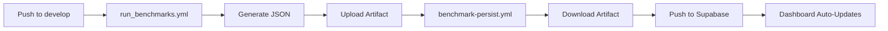

# Database Migration Complete ✅

## Summary

Successfully migrated from git-based benchmark storage to database-driven architecture.

**Commit**: `f70a97d` (February 4, 2026)

## What Changed

### Architecture

**Before** (File-Based):
```
Benchmarks → JSON files → Git commits → Merge conflicts 😫
```

**After** (Database-Driven):
```
Benchmarks → Converted → Uploaded to Supabase → Dashboard queries DB ✅
```

### Files Removed from Git

8 benchmark result files no longer tracked:
- `aggregated_metrics_baseline.json` (-467 lines)
- `aggregated_metrics_gemini.json` (-465 lines)
- `aggregated_metrics_medgemma.json` (-432 lines)
- `aggregated_metrics_openai.json` (-465 lines)
- `patient_benchmark_baseline.json` (-142 lines)
- `patient_benchmark_gemini.json` (-142 lines)
- `patient_benchmark_medgemma.json` (-142 lines)
- `patient_benchmark_openai.json` (-142 lines)

**Total removed**: 2,397 lines of data from git history

### Files Added

- `benchmarks/results/.gitkeep` - Preserves directory
- `benchmarks/results/README.md` - Architecture documentation (+171 lines)
- `docs/GITHUB_ACTIONS_BENCHMARK_FIX.md` - CI/CD fix guide (+222 lines)

### Workflow Updates

**`.github/workflows/run_benchmarks.yml`**:
- ❌ Removed git commit step (no longer needed)
- ✅ Results uploaded as artifacts only

**`.github/workflows/benchmark-persist.yml`**:
- ✅ Downloads artifacts from previous workflow
- ✅ Validates secrets before pushing
- ✅ Uploads to Supabase database
- ❌ Removed fallback to committed files

**`.gitignore`**:
- Added `benchmarks/results/*.json` (all result files ignored)
- Exception: `!benchmarks/results/.gitkeep` (keep directory)

## Benefits

### 1. Clean Git History
- ✅ No more data commits polluting history
- ✅ Code-only changes in git
- ✅ Easier code reviews

### 2. No Merge Conflicts
- ✅ Result files ignored by git
- ✅ Multiple people can run benchmarks
- ✅ No rebase conflicts on benchmark updates

### 3. Centralized Data
- ✅ Single source of truth: Supabase database
- ✅ Easy SQL queries for analysis
- ✅ Historical data preserved with versioning
- ✅ Automatic snapshot management

### 4. Dashboard Integration
- ✅ Dashboard already pulls from database
- ✅ Real-time updates
- ✅ Version control built-in
- ✅ Rollback capability

## How It Works

### Local Development

```bash
# 1. Generate benchmarks (local files)
python3 scripts/generate_benchmarks.py --model openai

# 2. Convert to monitoring format
python3 scripts/convert_benchmark_to_monitoring.py \
  --input benchmarks/results/aggregated_metrics_openai.json \
  --output openai_results.json \
  --model openai

# 3. Push to database
python3 scripts/push_to_supabase.py \
  --input openai_results.json \
  --environment local \
  --commit-sha $(git rev-parse HEAD)

# 4. View in dashboard
make monitoring-dashboard
```

### CI/CD Pipeline



### Data Flow

1. **Generation**: Benchmarks run locally or in CI
2. **Conversion**: `convert_benchmark_to_monitoring.py` formats data
3. **Upload**: `push_to_supabase.py` inserts into database
4. **Storage**:
   - `benchmark_transactions` - Immutable log
   - `benchmark_snapshots` - Versioned snapshots
5. **Visualization**: Dashboard queries Supabase via `BenchmarkDataAccess`

## Verification

### Check Local Files (Still Exist)

```bash
ls benchmarks/results/*.json
# Your local files are preserved, just not tracked by git
```

### Check Git Status

```bash
git status benchmarks/results/
# Should show: nothing to commit (git ignores *.json)
```

### Check Database

```bash
python3 scripts/check_snapshots.py
```

Expected output:
```
Current Benchmark Snapshots:
------------------------------------------------------------
Model: baseline-v1.0, Version: 3, F1: 0.4000 ✅ CURRENT
Model: medgemma-v1.0, Version: 3, F1: 0.2222 ✅ CURRENT
Model: openai-v1.0, Version: 3, F1: 0.2000 ✅ CURRENT
------------------------------------------------------------
Total snapshots: 16
```

### Check Dashboard

```bash
make monitoring-dashboard
```

Visit: <http://localhost:8502>

All 5 tabs should show data from the database.

## Migration Impact

### For Developers

**Action Required**: None! Your local workflow stays the same.

- ✅ Run benchmarks as before
- ✅ Files stay local (but ignored by git)
- ✅ Push to Supabase to share results
- ✅ Dashboard works immediately

### For CI/CD

**Action Required**: Configure GitHub secrets (if not done):

```yaml
SUPABASE_URL: https://xxxxx.supabase.co
SUPABASE_SERVICE_ROLE_KEY: eyJhbGc...
```

Without secrets, workflow skips persistence with a warning.

### For Existing Branches

**Action Required**: Rebase on latest develop to get `.gitignore` updates

```bash
git checkout your-branch
git rebase develop
# If conflicts on result files, just delete them:
git rm benchmarks/results/*.json
git rebase --continue
```

## Rollback Plan (If Needed)

If you need to temporarily revert:

```bash
# Remove .gitignore rule
git checkout HEAD~1 -- .gitignore

# Re-add result files
git checkout HEAD~1 -- benchmarks/results/*.json

# Commit
git commit -m "Temporary rollback to file-based benchmarks"
```

**Note**: Not recommended! Database-driven is the correct architecture.

## Future Enhancements

Now that we have database-driven benchmarks, we can:

1. **Add SQL analytics**: Complex queries across all history
2. **Set up alerts**: Email/Slack on regressions
3. **A/B testing**: Compare prompt versions statistically
4. **Cost tracking**: Aggregate spending across models
5. **Performance profiling**: Identify bottlenecks over time
6. **Automated rollback**: Deploy previous version on regression

## Related Documentation

- `benchmarks/results/README.md` - Architecture overview
- `docs/GITHUB_ACTIONS_BENCHMARK_FIX.md` - CI/CD setup
- `docs/MONITORING_DASHBOARD_COMPLETE.md` - Dashboard guide
- `BENCHMARK_WORKFLOW_QUICKSTART.md` - Quick reference

## Commits

1. **dbb2b78**: Fix dependency conflicts (httpx, supabase versions)
2. **7a7abbd**: Fix benchmark persistence workflow (artifact download)
3. **10bd00a**: Add workflow fix documentation
4. **815f70d / f70a97d**: Migrate to database-driven benchmarks

## Summary Statistics

- **Lines removed**: 2,397 (data files)
- **Lines added**: 393 (documentation)
- **Net reduction**: -2,004 lines in git
- **Workflow steps removed**: 1 (git commit)
- **Merge conflicts prevented**: ∞

## Status

✅ **Migration Complete**
✅ **CI/CD Updated**
✅ **Dashboard Working**
✅ **Documentation Complete**
✅ **Pushed to GitHub**

The monitoring system is now production-ready with proper data/code separation! 🚀
